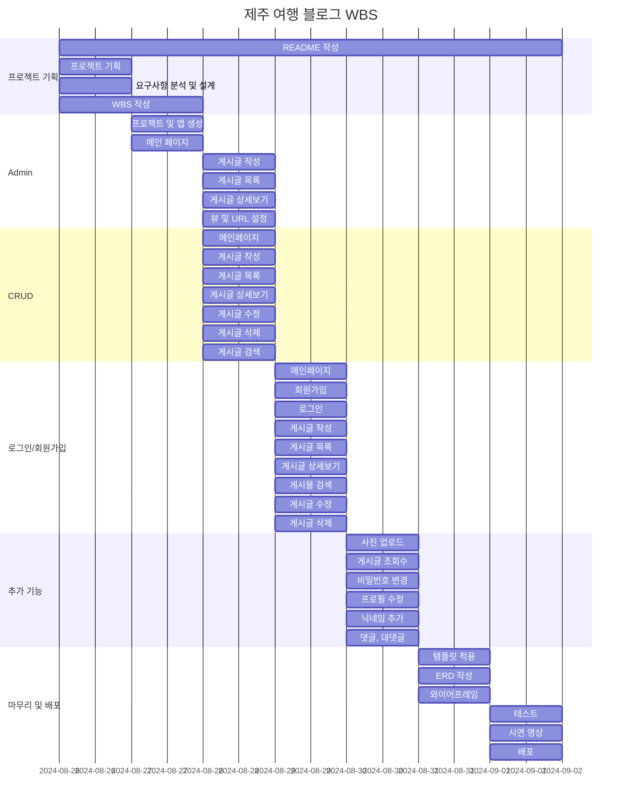

# Django_JejuTravelBlog
Django를 활용한 제주 여행 블로그 만들기 프로젝트
## 1. 프로젝트 소개
* 제주 여행 관련 정보를 얻고 다른 사용자와 공유할 수 있는 커뮤니티입니다.

## 2. 주요 기능
1. 회원가입 및 로그인
* 회원가입: 아이디, 비밀번호
* 로그인, 로그아웃
## 3. WBS

## 4. 와이어 프레임

## 5. ERD

## 6. URL 구조

## 7. 모델 구현

## 8. CRUD 구현

## 9. 인증 구현

## 10. 느낀점 및 개선사항
